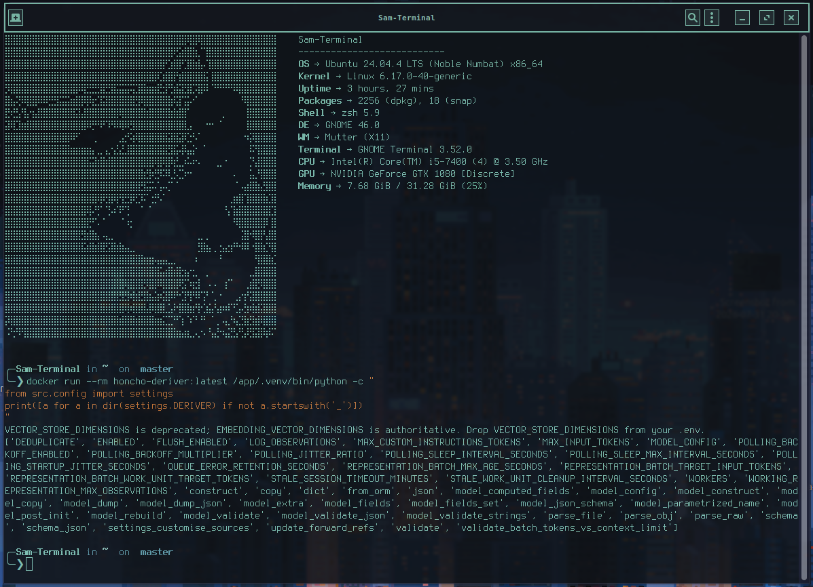
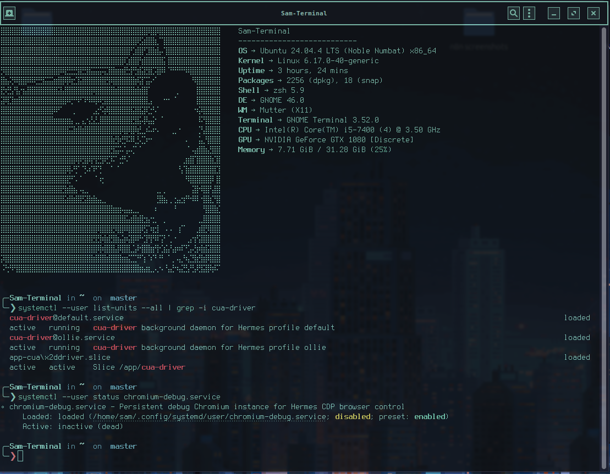
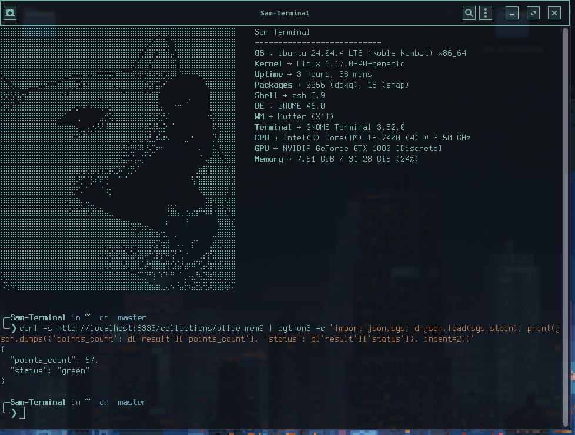
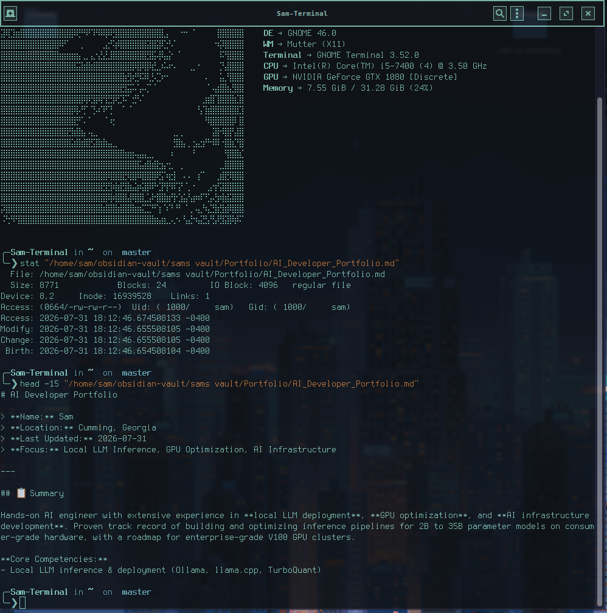

# Local AI Agent Stack — Hermes CLI + Persistent Memory

A local, autonomous agent built on Nous Research's Hermes Agent CLI — running entirely on
local hardware, with real cross-session memory, sandboxed code execution, and background
services that survive reboots instead of dying silently between sessions.

## Overview

The stack runs two isolated Hermes profiles so different workflows never share state:

- **`general`** — everyday assistant use
- **`orchestrator`** — a custom `guided-build` skill with Docker-sandboxed code execution

Inference is split across two machines to balance load: one handles memory fact-extraction,
the other handles embeddings. A connected Obsidian vault (via MCP) acts as a persistent
knowledge base the agent can read and write to.

## Tech stack

| Component | Role |
|---|---|
| Hermes Agent CLI | Core agent runtime, two isolated profiles |
| Ollama | Local inference, split across two machines |
| Obsidian (via MCP) | Persistent knowledge base |
| Mem0 (OSS mode) | In-process cross-session memory |
| Docker | Sandboxed code execution |
| systemd (`--user` units) | Keeps background daemons alive across reboots/logouts |

## Key engineering challenges

### 1. Diagnosing silent config drift, not guessing at a typo

The memory system was originally built on **Honcho**, a self-hosted memory service, pointed
at local Ollama models. It broke silently — the deriver kept falling back to a cloud default
instead of the configured local model — with no error thrown.

Rather than assume a typo in the config file, I opened a shell directly into the running
container and introspected the actual loaded settings object:

```bash
docker compose exec deriver /app/.venv/bin/python -c "
from src.config import settings
print([a for a in dir(settings.DERIVER) if not a.startswith('_')])
"
```

```
['DEDUPLICATE', 'ENABLED', 'FLUSH_ENABLED', ..., 'MODEL_CONFIG', ...]
```



That output was the actual root cause: there was no `PROVIDER` or `MODEL` field at all —
just `MODEL_CONFIG`. The fork I'd cloned (`--depth 1` off `main`) expected the *old* schema
(`PROVIDER`, `MODEL`, `BACKUP_PROVIDER`, `BACKUP_MODEL`), but current upstream Honcho had
migrated to a new structured `MODEL_CONFIG` object. Pydantic silently drops unrecognized
fields instead of erroring — so my entire config had been ignored from the start, with the
deriver quietly falling back to a default that failed against my fake local API key.

**The lesson:** don't trust a fork's example config against current upstream without
verifying the schema directly — introspecting the actual running settings object took two
commands and found the real problem immediately, versus continuing to guess at the `.toml`
file.

### 2. Making an infrastructure decision on evidence, not sunk cost

With the real cause identified, I had three real options:

1. Patch the fork to match the new schema
2. Switch to vanilla upstream Honcho directly
3. Drop Honcho entirely for **Mem0** (an in-process alternative)

I chose option 3. Honcho is a full standalone service — API, background worker, Postgres,
Redis, all in Docker — and everything that had gone wrong up to that point stemmed from that
complexity. Mem0 in OSS mode runs in-process inside Hermes itself: no extra Docker services,
no separate database. I already had a working Mem0 instance elsewhere in my stack for a
different purpose, so this reused infrastructure I already trusted rather than adding more
surface area to debug later.

### 3. Making background agent tooling survive reboots

A computer-use daemon (`cua-driver`) and a live-view Chromium debug browser kept silently
dying between sessions — they'd been started manually in a terminal that eventually closed,
with no process supervising them. I wrote proper `systemd --user` unit files for both so they
restart automatically and survive logout/reboot, following the same pattern for each:

```ini
[Unit]
Description=CUA Driver (computer_use daemon)

[Service]
ExecStart=/path/to/cua-driver serve
Restart=always

[Install]
WantedBy=default.target
```

Setting this up also surfaced a Chromium **snap-confinement** issue: its debug profile
directory couldn't be written to, which would have silently prevented logins and cookies from
persisting between agent browsing sessions — meaning every session would've quietly started
logged out, undermining the entire point of the live-view feature. Fixed by resolving the
profile directory's write permissions before wiring up the persistent service.



## Outcome

A working local agent stack with persistent cross-session memory (Mem0, in-process, no extra
infrastructure), sandboxed code execution, and background services that survive reboots
without manual restarting. This is active, ongoing work — memory-persistence tuning is still
being refined based on real day-to-day use.



Memory persistence is currently confirmed working on the `orchestrator` (`ollie`) profile;
extraction on the `general` profile is still being tuned.

The agent also writes directly into the connected Obsidian vault via MCP:



## Lessons learned

- **Introspect the real running state before trusting documentation or example configs** —
  especially for forks of actively-developed upstream projects, which can drift without
  warning.
- **Fewer moving parts is a legitimate infrastructure decision**, not just a shortcut — Mem0
  won over patching Honcho specifically because it removed an entire service dependency, not
  just because it was easier in the moment.

## Skills demonstrated

Root-cause diagnosis via direct source/system inspection (not guessing) · infrastructure
decision-making under real tradeoffs · Linux service management (`systemd --user`) ·
understanding silent-failure patterns in typed config systems (Pydantic) · comfort working
inside running containers
