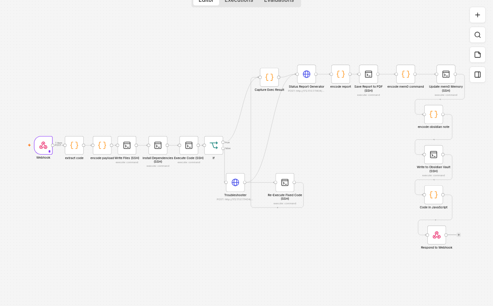
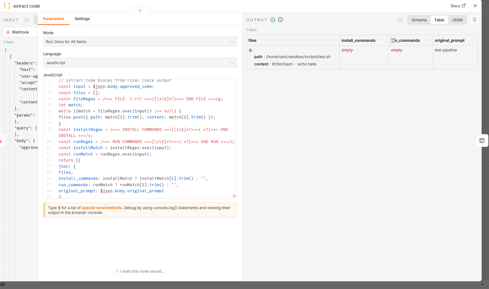
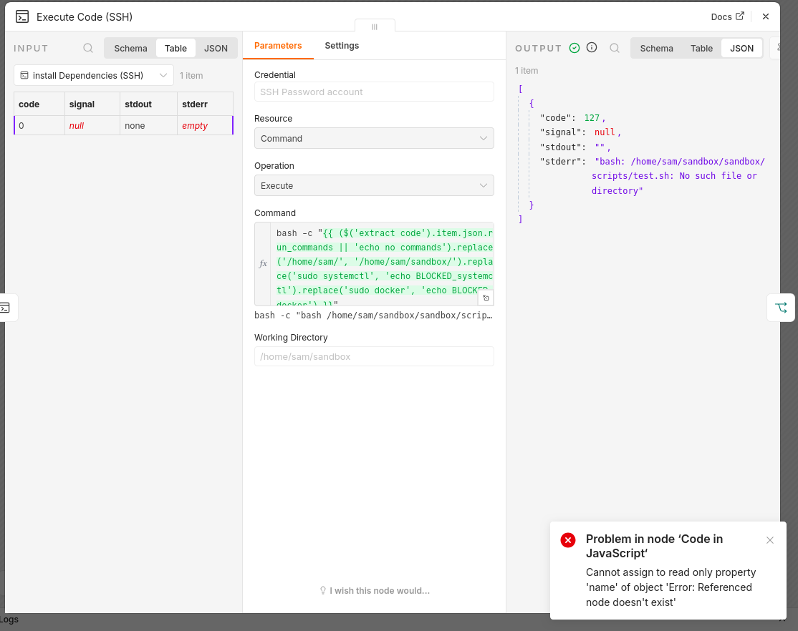
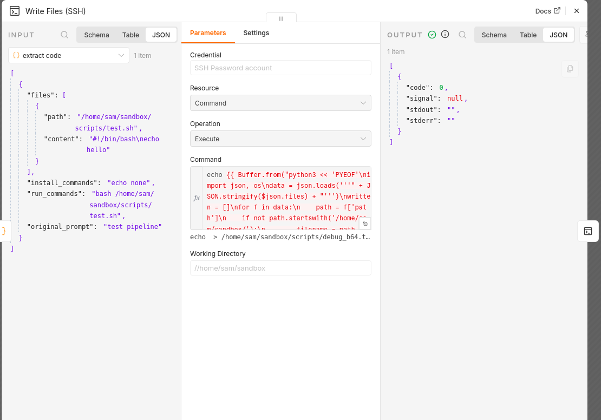
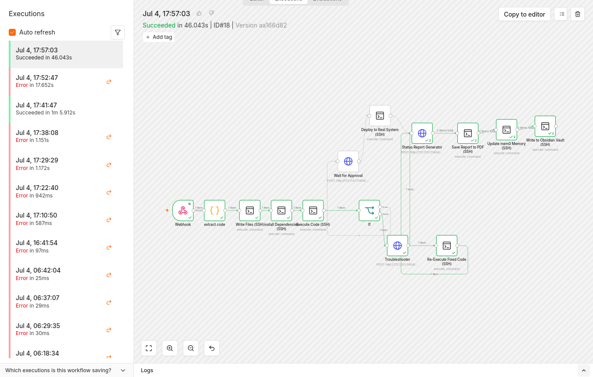
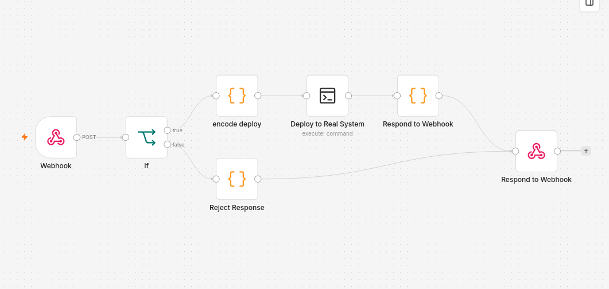

# SAM AI — Local Multi-Agent Code Automation Pipeline

A fully local, multi-step AI pipeline that turns a plain-English request into planned,
written, tested, and (with human approval) deployed code — with no cloud APIs and no
unreviewed code ever touching a real filesystem.



## Overview

SAM AI chains six local models together, each responsible for one stage of turning an idea
into working code:

```
PromptGenerator → Planner → PlanChecker → CodePlanner → Coder → FinalCheck
```

The output of that chain is handed to an n8n workflow, which writes the generated files into
an isolated sandbox, installs any dependencies, runs the code, and reports back what happened.
Nothing reaches the real filesystem until a human explicitly approves it through a dedicated
approval gate.

**Why this architecture:** splitting the work into six narrow stages, instead of one large
prompt, makes each step's output predictable and independently debuggable — which mattered a
lot once things started breaking (see below).

## Tech stack

| Component | Role |
|---|---|
| Open WebUI | Hosts and chains the six-model pipeline |
| Ollama | Local inference for all six models |
| n8n | Workflow engine — sandbox execution, reporting, approval gating |
| Docker | Containerizes n8n and Open WebUI |
| Custom webhook (`/webhook/approval-gate`) | Human-in-the-loop deployment gate |

## Key engineering challenges

The pipeline *looked* finished early on — it ran without errors — but silently produced
nothing in the sandbox. Finding out why took three separate root causes, each hiding behind
the last:

### 1. A regex that matched but captured nothing
The code-extraction step used a regex expecting **two** `===` delimiters between a header and
the file content. The model's real output only ever produced **one**. The regex still
"matched," so no error was thrown — but the capture group came back empty every time. Found by
comparing the regex against a real captured payload character-by-character instead of guessing
from the symptom.

```js
// Before — silently over-matched, capture group empty
/===\s*COMMANDS\s*===[\s\S]*?===(.*?)===/

// After — captures everything up to the real END marker
/===\s*COMMANDS\s*===([\s\S]*?)===\s*END/
```



### 2. A templating filter that doesn't exist in this engine
A downstream node used `{{ $json.files | dump }}` — a Jinja/Nunjucks filter. n8n's expression
engine is JavaScript, not Jinja, so `| dump` silently failed to render instead of throwing a
visible error. Fixed by switching to the JS-native equivalent:

```js
// Before (Jinja syntax, invalid in n8n)
{{ $json.files | dump }}

// After (n8n's actual JS expression engine)
{{ JSON.stringify($json.files) }}
```

### 3. A heredoc that never actually engaged
Even after both fixes above, a multi-line Python script sent through an SSH node was being
executed **line-by-line by bash itself**, not handed to Python — bash tried to parse Python
syntax and failed on the first `import` line. The heredoc wrapper (`python3 << 'PYEOF' ...
PYEOF`) wasn't surviving intact through the SSH node's command field, most likely losing its
real newlines in transit.



Rather than keep chasing exactly where the newlines got mangled, the fix made the whole
payload immune to that entire class of problem: base64-encode the script and its data into one
unbroken line, then decode-and-execute on the remote end.

```bash
echo <base64-encoded script+data> | base64 -d | bash
```

Nothing about a text field, copy-paste, or SSH transport can break a base64 string by
re-wrapping lines, because it contains no real line breaks to mangle.



### Other issues fixed along the way
- SSH nodes silently overwriting `$json` between steps — fixed with explicit
  `$('Node Name').item.json` references instead of relying on implicit context
- JSON control-character escaping breaking payloads mid-pipeline
- A double-path-rewriting bug in how the sandbox resolved file paths

## Outcome

A working six-step pipeline that plans, writes, tests, and — with explicit human approval —
deploys code to a real filesystem, running entirely on local infrastructure. Currently in an
optimization phase based on real usage patterns.



The separate human-approval webhook workflow that gates real-filesystem deployment:



## Lessons learned

- **Silent failures are more dangerous than loud ones.** Every bug above "succeeded" without
  an error — the regex matched, the template rendered *something*, the SSH command "ran." The
  actual debugging skill was verifying real output at each stage rather than trusting the
  absence of an error message.
- **Cross-boundary payloads (SSH, templating, shell) should be encoded defensively from the
  start.** The base64 approach that fixed bug #3 is a pattern worth applying proactively next
  time, not just after hitting the transport-mangling problem it prevents.

## Skills demonstrated

Systematic debugging methodology · multi-language interop (JavaScript/n8n expressions, Python,
bash) · workflow orchestration design · security-conscious system design (human-in-the-loop
approval before any real deployment) · diagnosing failures that succeed silently rather than
erroring loudly
